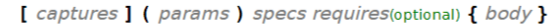

# C++

## Введение

*С++ - стандартизированный язык, существуют специальные документы, описывающие его работу.*

* Исходный код > **.cpp** < *Текстовый файл*
* Компиляция > **.obj** < *Бинарный код со служебной информацией*
* Линковка > **.exe, .lib, .dll** < *Бинарный код*
* Исполнение

### Компиляторы и линковщики, отладчики

* Microsoft Visual C++ Compiler < MSVC > MSBuild/Visual Studio

  ``C:\ cl.exe /c main.cpp`` *- компиляция*

  ``C:\ link.exe main.obj`` *- линковка*

* Linux g++ < GNU Compiler Collection > GDB

  ``$ g++ -c main.cpp`` *- компиляция*

  ``$ g++ main.o -o main`` *- линковка*

* Кроссплатформенный Clang < фреймворк компиляторов LLVM > LLDB

  ``$ clang -c main.cpp`` *- компиляция*

  ``$ clang main.o -o main`` *- линковка*

*С++ - надмножество C, т.е. код на C скорее всего будет корректно скомпилирован компилятором для С++.*

### Отладка

* построчная отладка, точки останова и т.д.
* есть отладчик - дополнительная программа для отладки
* *компилятор-линковщик-отладчик - **tool chain***
* ``$ g++ -g main.cpp -o main_for_debug``
* при помощи флагов можно контролировать оптимизации (``-03`` - для релиза, ``-01`` - меньше опций)

### В С++ добавлен функционал для упрощения

* ООП
* Обобщенного программирования
* Оперирования абстрактными контейнерами данных

### Встроенные типы данных


### Ввод/вывод

##### std::cout

* объект класса ostream для взаимодействия со стандартным потоком вывода
* ``<<`` - inserter
* может быть приспособлен для вывода пользовательских классов

##### std::cin

* объект класса istream для взаимодействия со стандартным потоком ввода
* ``>>`` - extractor
* может быть приспособлен для вывода пользовательских классов

```c++
#include <iostream>
int main(int argc, char* argv[]) {
    std::cout << "Hi";
    int foo;
    std::cin >> foo;
    std::cout << (foo + 2);
    return 0;
}
```

## New/delete, ссылки, функции

### Динамическая память

Переменные, объявленные через их тип,
хранятся на **стеке** как **автоматические переменные**,
порядок их хранения определяется при компиляции.

Память динамического размера выделяется на **куче**.

```c++
#include <iostream>
int main(int argc, char* argv[]) {
    int* pointer = nullptr;
    pointer = new int;
    
    char* dynamic_arr = nullptr;
    dynamic_arr = new char[6];
    
    // initialization
    
    delete[] dynamic_arr;
    delete pointer;
    return 0;
}
```

Динамическим может быть **только первое измерение** многомерного
массива.

```c++
#include <iostream>
int main(int argc, char* argv[]) {
    int size = 10;
    auto dynamic_arr = new char[size][5];
    delete[] dynamic_arr;
    return 0;
}
```

*Попытка дважды освободить одну и ту же память вызовет segmentation
fault, а неосвобождение приведет к утечке памяти.*

Хорошим тоном будет проверять указатель на nullptr и при выделении, и при освобождении памяти.

### Ссылки

Ссылки похожи на указатели, но работать с ними проще.

```c++
#include <iostream>
int main(int argc, char* argv[]) {
    int a = -1;
    int& link = a;
    
    link += 1 // a = 0, link = 0
    return 0;
}
```

Если ссылка объявлена, как константа, то переменная, на которую она ссылается,
не будет доступна для изменения по этой ссылке: ``const int& link = a;``.
Ссылка на константу также может быть только константой.

### Функции

#### Декларация и определение

```c++
int f1(int c) {
  return c + 1;
}
```

Декларация / Сигнатура / Прототип

```int f1(int c);```

Определение / Тело

```return c + 1;```

#### Аргументы

По умолчанию в функции передаются **копии** аргументов.
В качестве аргумента можно также передать *указатель*, тогда в теле функции
можно будет изменить переменную по этому указателю (и любую память вокруг):
``int f2(int* pointer)`` < ``f2(&a)``.
В сигнатуре можно указать аргумент как *ссылку*, тогда его копия не будет создана:
``int f3(int& link)`` < ``f3(a)``.

Функции могут *возвращать ссылку*: ``int& f4()``, однако возврат ссылки
на локальную для функции переменную приведет к **неопределённому поведению**.

Аргументы могут быть *проинициализированы по умолчанию*: ``int f4(int x = 10)``.

#### Перегрузка функций

**Function overloading** - определение нескольких функций с одним
именем, но разными аргументами (обязательно) или типами возвращаемых значений (необязательно).

``void print(int x)``

``void print(double x)``

Если в функцию переданы аргументы, не в точности соответствующие сигнатуре,
то будет выбрана наиболее подходящая, если такой не будет найдено, то произойдет
ошибка компиляции.

#### Шаблонные функции

```c++
template<class/typename T>
T f(T x, T y) {
  return (x > y)? x : y;
}
```

Перед вызовом функции можно указать, для какого именно типа требуется
вызвать ее: ``f<double>(x, y);``, иначе это будет определено автоматически.

#### Специализация шаблонов

Для специфического набора типов аргументов можно ввести **template specialization**.

```c++
template<class T>
T f(T x, T y) {
  return (x > y)? x : y;
}

template<>
char* f<char*>(char* x, char* y){
  ...
}
```

## Классы

В классе могут быть сгруппированы переменные (**поля класса**) и функции (**методы класса**).

```c++
#include <iostream>

class Point {
  public:
    double x, y;
    void print() {
      std::cout << x << ";" << y;
    }
};

int main(int argc, char* argv[]){
  Point a; // инстаниация
  a.x = 1.0;
  a.y = 2.0;
  return 0;
}
```

Можно объявлять указатели на объекты пользовательских классов, тогда для доступа к полям и методам
объекта можно будет обратиться и без разыменования: ``pointer.x -> 1.0;``, ссылки: ``Point& link = a;``, для которых
возможно обращение к полям и методам напрямую.

### this

Все поля класса доступны к чтению внутри его методов.

**this** - ключевое слово, соответствующее адресу текущего объекта: ``this->x += a;``. *Является **неявным** первым
аргументом для всех методов класса.*

### Перегрузка методов

Возможна для методов пользовательских классов и работает аналогично перегрузке функций.

### Конструкторы

Конструкторы помогают объединить момент инстаниации объекта и инициализации его полей.

```c++
class Point {
  public:
    Point(double X, double Y) {
      x = X;
      y = Y;
    }
    
    double x, y;
    void print() {
      std::cout << x << ";" << y;
    }
};
```

Теперь для создания объекта можно явно указать значения его полей: ``Point a(0.0, 2.0);``. Можно воспользоваться
динамическим вариантом: ``Point* pointer = new Point(-1.0, -2.0);``, не забыв при этом очистить память по указателю.

Конструкторы также можно перегружать.

### Деструктор

В конце жизни объекта класса вызывается особый метод - деструктор, который также может быть определен при определении
класса. Он не принимает параметров, не возвращает значения и не может быть перегружен.

```c++
class Point {
  public:
    Point(double X, double Y) {
      x = X;
      y = Y;
    }
    
    double x, y;
    void print() {
      std::cout << x << ";" << y;
    }
    
    ~Point() {
      // обычно используется для корректного освобождения памяти, которая выделялась объектом класса.
      std::cout << "Destructor called";
    }
};
```

## Классы

### Виды инициализации объектов класса

#### Конструктор

```c++
Point(double X, double Y) {
  x = X;
  y = Y;
}
```

#### Конструктор по умолчанию

```c++
Point() {
  x = 0.0;
  y = 1.0;
}
```

#### Конструктор по ссылке (копия)

```c++
Point(const Point& point1) {
  x = point1.x;
  y = point1.y;
}
```

#### Список инициализации членов класса

Может быть у любого конструктора, помогает инициализировать поля сразу конкретным образом.

Позволяет вызвать один из других конструкторов перед началом выполнения тела текущего конструктора.

```c++
  double x, y;
Point() : x(0.0), y(0.0) {
// default
}

Point(double X) : Point() { // будет вызван сначала дефолтный конструктор
// single-arg // и только затем выполнено тело вызванного конструктора
}
```

*Поля будут проинициализированы в порядке их определения в классе.*

```c++
  Point() : x(0.0), y(0.0) {}
```

#### Инициализация поля "по умолчанию"

Улучшает читаемость.

```c++
class Circle {
  public:
    double radius = 1;
    Point center = Point(1.0, 0.5);
}
```

### Оператор расширения области видимости (::)

Необходим для доступа к глобальной переменной, если существует локальная с таким же именем.

```c++
int x = 777;
std::cout << "Local: " << x;
std::cout << "Global: " << ::x;
```

### Статические поля

Статические поля становятся общими на весь класс и **приобретают глобальное время жизни**.

``static long quantity;``

``long int::quantity = 0;`` - статические поля, не являющиеся константами, должны быть проинициализированы вне класса.

Доступ к статическим полям:

* ``Point::quantity``
* ``point.quantity``
* ``point->quantity``

### Статические методы

Тело статического метода не может ссылаться на не-статические поля класса или this.
*Доступ* к методу осуществляется аналогично статическим полям.
**Для обращения к статическим методам класса необязательно создавать объект этого класса.**

```c++
void Point::print() {
  std::cout << '(' << x << ';' << y << ')';
}
```

### Перегрузка операторов

Чтобы операторами можно было пользоваться при работе с объектами пользовательского класса,
нужно определить функцию со специальным именем:

```c++
Point operator+(const Point a, const Point b) {
  return Point(a.x + b.x, a.y + b.y);
}
```

Теперь ``point1 + point2;`` эквивалентно ``operator+(point1, point2);``.

Перегружать оператор можно любым образом и возвращать значение любого типа.
*Можно перегрузить оператор, как метод класса.*
**Сигнатура перегружаемого оператора должна соответствовать его дефолтной арности.**

#### Все операторы, которые можно перегрузить:


#### Общая форма определения перегруженного оператора

```c++
T operator/перегружаемый оператор/(...) { ... }
```

### Перегрузка оператора присваивания

Такую перегрузку называют *оператором присваивания с копированием*.

```c++
Point& operator=(const Point& a) {
  return Point(a.x, a.y);
}
```

Обычно оператор переопределяют так, чтобы работали цепочки присваиваний: ``point1 = point2 = point3;``.

### Правило трех

**If a class requires a user-defined destructor, copy constructor or copy assignment operator, it almost certainly
requires all three.**

## Многофайловая разработка

Компиляция происходит независимо для каждого файла с исходным кодом,
каждый входной файл для компилятора называется **единицей трансляции**.

**Линковка** необходима для того, чтобы корректно выстроить зависимости между файлами. Она осуществляется
между импортируемыми и экспортируемыми символами в объектных файлах после компиляции.

**hello.cpp** < definition

```c++
const char* get_hello() {
  return "hello ";
}
```

**world.cpp** < definition

```c++
const char* get_world() {
  return "world\n";
}
```

**hello_world.cpp** < declarations

```c++
const char* get_hello();
const char* get_world();

int main(int argc, char* argv[]){
  std::cout << get_hello() << get_world();
  return 0;
 }
```

### Заголовочные файлы

В заголовочных файлах типа .h/.hpp можно задекларировать все используемые в проекте функции.
Для файла, в котором потребуются функции, можно сделать ``#include "world.h"``. Содержимое заголовочных файлов будет
вставлено без изменений вместо строчки с директивой.

Можно использовать заголовочные файлы для определения класса, декларируя его в main.cpp

**point.h**

```c++
class Point {
public:
  double x, y;
  Point(double x_, double y_);
  void print();
}
```

**main.cpp**

```c++
#include "point.h"

Point::Point(double x_, double y_) : x(x_), y(y_) {
  std::cout << "constructor";
}

void Point::print() {
  std::cout << x << ' ' << y;
}
```

### One definition rule

**В любой единице трансляции допустимо только одно определение любой переменной, функции, типа класса, типа перечисления
и т.д.**

### Include guards

Для того чтобы это правило не было нарушено при использовании заголовочных файлов, во всех заголовках указывается
следующая последовательность команд препроцессора:

**header.h**

```c++
#ifndef HEADER_H
#define HEADER_H

...

#endif
```

### Организация кода

* разделение на отдельные единицы трансляции с целью логической группировки кода.
* отделение объявлений от определений, вынос последних в заголовочные файлы
* вынос всех заголовочных файлов в отдельную директорию
* сложная иерархия директорий для отражения структуры приложения

### Системы построения

В больших проектах команду для компиляции и линковки приложения составляют не руками, а пользуются системами построения,
которые не являются кросс-платформенной.

На Unix используется утилита make, принимающая конфигурацию из файла Makefile.
**CMake** - стандарт, гибкий и кросс-платформенный.

## Namespaces, class templates, STL, std::vector

### Пространства имен

Блоки **namespace**  помогают разрешать коллизии различных названий.

```c++
namespace v1 { int a = 0; }

namespace v2 { int a = -1; }

int main() {
  std::cout << v1::a << v2::a;
}
```

*Директивы using не рекомендуется использовать без хорошей причины, особенно в глобальной области видимости.*

``using namespace_a::a;`` позволит использовать идентификаторы без "::",
``using namespace namespace_a;`` или весь namespace.

*Можно вкладывать пространства имен друг в друга.*
Нельзя переиспользовать имена из безымянного namespace в других единицах трансляции.

**using** используется также, чтобы заводить пользовательские названия существующих типов:
``using my_double = double;``

### Шаблоны классов

```c++
template<class T>
class Point {
  public:
    T x, y;
    Point(const T& x_, const T& y_) : x(x_), y(y_) {}
};

Point<float> float_point(1.0, 1.2);
Point<int> int_point(1, 2);
```

*При имплементации методов невозможно вынести в отдельный файл от их объявления при использовании шаблонов классов.*

### STL

**Standard Template Library** - набор шаблонов классов и функций, имплементирующих полезную функциональность.

Шаблоны и объекты хранятся в динамической библиотеке, доступ из пользовательского кода возможен через использование
заголовочных файлов.

**Содержимое STL**

* *контейнеры* - хранилища элементов, имеющих в имплементации фундаментальные структуры данных.
* *итераторы* - объекты, позволяющие удобно перебирать элементы в контейнерах.
* *алгоритмы* - функции/объекты, выполняющие вычисления с некоторыми типами.

### extern

Ключевое слово в сочетании с именем переменной декларирует, что переменная с этим именем и типом существует в другой
единице трансляции, и ее не нужно декларировать заново.

### std::vector

**Вектор** - контейнер, обертка над динамическим одномерным массивом для произвольных типов элементов.

```c++
#include <vector>
#include "Point.h"

int main(int argc, char* argv[]) {
  std::vector<int> vector_of_int;
}
```

#### Member functions


#### Capacity


#### Modifiers


#### Базовое использование

```c++
#include <vector>
#include <iostream>

int main(int argc, char* argv[]) {
  std::vector<int> v(5); // 5 elements
  vec.size(); // equal to 5
  vec[i] = 5;
  return 0;
}
```

``v.push_back(i);`` - позволяет добавить элемент в конец массива.

``v.pop_back;`` - позволяет удалить элемент в конце массива.

## STL, итераторы, std::array, std::string

### std::vector::capacity VS std::vector::size

**Размер вектора** - это количество хранимых в данный момент элементов, тогда как **емкость** - количество памяти,
зарезервированной под будущие элементы.

### Итераторы


**Итераторы** - объекты, помогающие получать доступ к элементам контейнеров; также, как и для указателей, для них
работают "разыменование" и арифметика.

```c++
int size = 5;
std::vector<int> v(size)
std::vector<int>::iterator it = v.begin(); // указатель на "первый по порядку" элемент в контейнере

for (int i = 0; i < size; i++){
    std::vector<int>::iterator i_at_elem = i + it;
    *i_at_elem = 42;
}
```

``std::vector<int>::iterator i = v.end();`` - итератор, указывающий на следующий после последнего элемент контейнера.

``std::vector<int>::iterator i = v.rbegin();`` - *reversed begin*.
``std::vector<int>::iterator i = v.rend();``- *reversed end*.

``std::vector<int>::iterator i = v.cbegin();``- *constant begin*, через него нельзя изменять значения и можно
использовать его с константными значениями.

``double first = v.front();`` - ссылка на элемент, находящийся в начале вектора - не является итератором; аналогично
для ``v.back``.

### std::array

**std::array** - шаблонизированный класс, являющийся STL-оберткой над статическими массивами. Размер массива фиксирован
на момент компиляции. Он удобнее обычных статических массивов благодаря вспомогательных методов и операторов.

```c++
std::array<double, 20> a;
for (std::array<double, 20>::iterator i = a.begin(); i != a.end(); i++){
    std::cin >> *i;
}

std::array,double, 20> a_copy;
a_copy = a;
```

### std::string

**std::string** - контейнер для строковых данных, является конкретной инстанциацией шаблонного класса std::basic_string.

```c++
#include <iostream>
#include <string>

int main(){
    std::string a;
    a = "bar";
    std::cout << a.size(); // 3
    
    return 0;
}
```


## Most Vexing Parse, std::initializer_list, range-based for, auto

### Most Vexing Parse

```c++
class A {
    public:
    A() {}
    A(int parameter) {}
    void method() {}
};

int main() {
    A object;
    A object_1(42);
    A object_2(); // default constructor may be called, but C++ parses this as a function, not an object.
    A object_3{}; // this is possible.
}
```

### List-initialization

Начиная с C++11, можно использовать **{}** вместо **()** при указании параметров конструктора, что позволяет избавиться
от MVP,
но представляет **особый тип инициализации**, если параметров в скобках больше одного.

**List-initialization** инициализирует объекты из *braced-init-list*.

### !!! std::initializer_list

Автоматически будет сконструирован компилятором, когда braced-init-list будет использован для инициализации объекта
конструктором со списком инициализации.

### auto

```c++
auto a = 3; // int
auto b = a; // int

auto c = 8.0 // double
```

```c++
#include <vector>

std::vector<int> f() { return std::vector<int>(); }

int main() {
    auto& f_value = f(); // error: cannot bind non-const lvalue reference of type 'std::vector<int>&' 
    // to an rvalue of type 'std::vector<int>'.
}
```

### range-based for

Реализует цикл for для некоторого промежутка. Используется для улучшения читаемости.

```c++
std::string s("hello");
std::vector<char> letters;

for (char c: s) {
    letters.push_back(c);
}
```

*std::initializer_list может использоваться в range_based for:*

```c++
for (int n : {1, 2, 3}){ }
```

**auto в сочетании с range-based for приводят к очень удобной и краткой записи кода.**

## Инвалидация операторов, работа со временем, генерация псевдослучайных чисел

### Инвалидация итераторов

Итератор, объявленный внутри функции и переданный в вызывающую область кода, будет указывать на уже уничтоженный из-за
времени жизни объект.

After **resize() && insert()** operations all iterators and references are invalidated.

*Опасный пример утечки памяти с **итератором***

```c++
std::vector<int> v = {1, 2, 3, 4, 5};
auto second1 = v.begin() + 2;

v.resize(10); // << приводит к реаллокации, поэтому имеющиеся итераторы становится не валидными.

auto second2 = v.begin() + 2;
*second2 = 42;

std::cout << *second1; // 3 (not 42) and segmentation fault
```

*Пример некорректного использования итератора в цикле*

```c++
for (auto i = v.cbegin(); i != v.cend(); i++){
    v.insert(i, 0); // segmentation fault уже на 2-й итерации цикла
}
```

*Пример корректного использования итератора в цикле*

```c++
std::vector<int> v = {1, 2, 3, 4, 5};
v.reserve(10); // удерживает память за v

for (auto i = v.cbegin(); i != v.cend(); i++) {
    v.insert(i + 1, 0);
    i += 1;
}
```

### Работа со временем

STL предоставляет примитивы для работы со временем в заголовке <chrono>.

* ``std::chrono::*_clock`` - **часы**, задаются точкой начала отсчета и периодичностью засекаемых временных отрезков.
    * ``std::chrono::system_clock`` - текущее системное время (*необязательно монотонно*).
    * ``std::chrono::steady_clock`` - некоторый внутренний таймер, не связанный с системным временем (*обязательно
      монотонно*).
* ``std::duration`` - **временная длительность**, определяется как число отсчетов заданной периодичности.

  *Шаблонный класс*, для инстанциации которого нужно указать первым параметром подлежащее хранилище заданных отсчетов и
  временной промежуток (по умолчанию - 1 с). Хранилище может быть целым числом, но необходимо явное
  преобразование ``std::chrono::duration_cast<T>``.

* ``std::time_point``- **точка во времени**, число отсчетов некоторой периодичности с начала отсчета.

*Удобно использовать auto для сокращения кода.*

```c++
#include <chrono>

std::chrono::steady_clock clock;
auto log_start = std::chrono::system_clock::now();
log_starting_time(log_start);
auto start = clock.now();

...

auto finish = clock.now();

std::chrono::duration<double> runtime = finish - start;
 ```

#### Длительность

В пространстве имен ``std::literals`` доступны литералы, упрощающие взаимодействие с ``std::chrono::duration``
-объектами:

```c++
using namespace std::literals;

std::chrono::duration<double> min15 = 0.25h;
std::chrono::duration<double> hour2 = 120min;
```

#### Простейшая имплементация спин-лока

*Позволяет сделать ожидание в коде без переключения потоков.*

```c++
using namespace std::literals;
auto start = std::chrono::steady_clock::now();

while (std::chrono::steady_clock::now() - start < 10s) {
    ...waits for 10s...
}
```

### Генерация псевдослучайных чисел

Существуют различные "движки", позволяющие различную генерацию псевдослучайных целых чисел.


```c++
#include <iostream>
#include <random>

int main() {
    std::mt19937 mt_engine;
    mt_engine.seed(0);
}
```

*Типичный способ обойти "неслучайность" генерации - использовать в качестве seed текущее время.*

```c++
std::mt19937 mt_engine(std::chrono::system_clock::now().time_since_epoch().count());

std::uniform_int_distribution<int> dist(1, 100);

std::cout << dist(mt_engine); // случайное число в диапазоне от 1 до 100.
```

## Контейнеры

### Условная классификация

Sequence containers


Associative containers


Span


### std::deque

```c++
#include <deque>
#include <iostream>

int main() {
    std::deque<int> dq;
    dq.push_back(9);
    dq.push_front(4);
    for (const auto i : dq) { ... }
    
    return 0;
}
```

**Поддерживаются:**

* push_front, push_back
* pop_front, pop_back
* insert
* operator[] для индексации

**Вставка и удаление в оба конца deque никогда не делает указатели и ссылки некорректными (однако итераторы
инвалидируются).** При этом жертвуется непрерывным хранением элементов в памяти - они хранятся в непрерывных кусках (
chunks) как векторы или динамические массивы, указатели на куски обычно хранятся с помощью map.

! *нет конструктора со списком инициализации*.

### std::list

Двусвязный список; элементы не хранятся в памяти непрерывно, итераторы не поддерживают произвольную арифметику - только
инкрементирование и декрементирование.

```c++
std::list<int> l {1, 0, -1, 2, 5};

auto last_i = --(v.end());
auto second_i = ++(v.begin());

l.insert(v.end(), 4);
l.erase(second_i);
```

**Итераторы инвалидируются только при удалении элемента из списка.**

### std::forward_list

Односвязный список; итерация возможна только в одном направлении.

### std::queue

Адаптирует контейнеры так, чтобы пользователь получил функционал очереди (обертка над контейнером типа Container).


### std:: stack

Так же как и очередь, адаптирует под свою логику класс Container.


### Классификация итераторов

* Input iterator
* Output iterator
* Forward iterator
* Bidirectional iterator
* Random access iterator
  

### std::pair

Шаблон класса, позволяющий хранение двух разнородных объектов в виде единого элемента.

```c++
#include <utility>
#include <iostream>

int main() {
    std::pair<double, int> weight_and_age(7.0, 9);
    std::pair<double, double> point(9.0, 7.7);
}
```

### std::tuple

Обобщение *std::pair*, которое позволяет в одной переменной хранить несколько значений разных типов; их количество и тип
фиксированы на момент компиляции.


### std::unordered_map

Ассоциативный контейнер (словарь), имплементированный через хэш-таблицу, не работает с пользовательскими типами (
необходимо перегрузить генерацию хэш-кода для них).

```c++
std::unordered_map<std::string, int> name_and_age = {
        {"Dt E", 88}
};
name_and_age["Michael"] = 23; // inserts a new element

auto i = name_and_age.find("Dt E");
auto i = name_and_age.contains("Dt E");
```

## Контейнеры, функциональные объекты, cv-квалификаторы

### Функциональные объекты

*Одинаковым образом будут выглядеть указатели на функции, вызовы конструктора класса, а также функциональные объекты.*

**Функтор** - класс, в котором переопределен ``operator()``; такой объект будет действовать, как функция, но также
хранить состояние.

```c++
class SimpleFunctor {
    std::string name;
   
public:
    SimpleFunctor(const char *name) : name(name_) {}
    void operator()() { std::cout << "Hello"; }
};

int main() {
    SimpleFunctor sf("Kate");
    sf(); // объект, который может быть вызван как функция
}
```

Часто для функциональных объектов используют ``struct`` вместо ``class``, - в структурах не нужно указывать спецификатор
доступа.

### cv-квалификаторы

Квалификаторы типов const и volatile:

* *const* - соответсвующий идентификатор нельзя модифицировать после создания.
* *volatile* - доступы к соответствующему идентификатору запрещено оптимизировать или кэшировать компилятору.

```c++
int main() {
    int n1 = 0; // non-const
    const int n2 = 0; // const
    volatile int n3 = 0; // volatile
    
    n1 = 1; // OK
    n2 = 2; // error
    n3 = 3; // OK, treated as a side effect
}
```

*cv-qualifiers в аргументах функции не являются частью ее типа, могут быть указаны для возвращаемого значения, что, в
целом, бессмысленно.* Нельзя перегрузить функцию, изменив лишь cv-квалификатор ее аргумента.

Для методов объектов, имеющих сигнатуру вида ``int get_a() const { }`` cv-квалификатор будет являться частью типа
метода, таким образом, методы можно будет перегружать.

**const-корректность** заключается в указании квалификатора для аргументов, которым не следует по смыслу меняться в
функции, или методов, которые не должны по смыслу менять состояние текущего объекта.

### std::unordered_map

Так как unordered_map использует алгоритм хэширования, он не может хэшировать пользовательский тип данных. Существует
шаблонный класс (в виде структуры) std::hash, вычисляющий хэш пришедшего объекта. Для неспециализированного шаблона
operator() убран специально, так как его действие не определено.

```c++
#include <unordered_map>
#include <string>
#include <iostream>

class Color {
    public:
    int r, g, b;
    bool operator==(const Color& rhs) const {
        return this->r == rhs.r && this->g == rhs.g && this->b == rhs.b;
    }
};

struct MyHasher {
    std::int operator()(const Color& c) const {
        std::int h1 = std::hash<int>{}(c.r);
        std::int h2 = std::hash<int>{}(c.g);
        std::int h3 = std::hash<int>{}(c.b);
        retrun h1 ^ (h2 << 1) ^ (h3 << 2); // побитовые сдвиги влево
    }
};

using ColorNameMap = std::unordered_map<Color, std::string, MyHasher>;
using ColorNameMapEntry = std::pair<Color, std::string>;

int main(){
    ColorNameMap color_map = {
            {{255, 0, 0}, "Red"},
            {{0, 255, 0}, "Green"},
            {{0, 0, 255}, "Blue"},
    }
    
    Color c = {255, 0, 0};
    std::cout << color_map[color]; // Red
}
```

Итераторы инвалидируются, если какая-либо операция приводит к рехэшированию.

#### Множитель нагрузки

``color_map.max_load_factor()`` - позволяет контролировать количество элементов в списке при коллизиях.

## Контейнеры, std::function, лямбда-функции, захват переменных

Неупорядоченные ассоциативные контейнеры (unordered_map, unordered_set, unordered_multimap, unordered_multiset)
поддерживают только одностороннюю итерацию.

### std::unordered_set

Аналогично std::unordered_map по внутреннему устройству, однако хранит только ключи без значений. В любой момент
элементы множества являются уникальными с точки зрения функторов Hash и KeyEqual.

*operator[] не определен, вместо него используются ``.insert`` и ``.emplace``.*

### std:unordered_multimap

Аналогичен std::unordered_map, Но позволяет хранить несколько значений для одного ключа.

*operator[] не определен, необходимо использовать ``.insert``.*

### std::unordered_multiset

**Defined in header <unordered_set>.**

Похож на std::unordered_multimap: организован с помощью хэш-таблицы, поиск, вставка и удаление за константное время, но
не гарантирует уникальность содержащихся в нем элементов.

*Упорядоченные* ассоциативные контейнеры имеют другую подлежащую имплементацию и, как следствие, другую асимптотику
операций. Они реализованы с помощью **красно-черных деревьев**.

### std::map

Это ассоциативный контейнер, в любой момент времени отсортированный по "возрастанию" ключей и в котором ключи уникальны.
Ключи должны быть сравнимы, функтор сравнения должен быть представлен в качестве шаблонного параметра Compare.

```c++
#include <map>
#include <iostream>

int main() {
    std::map<int, std::string> order_vs_weekday;
    
    order_vs_weekday[1] = "monday";
    order_vs_weekday[3] = "wednesday";
    order_vs_weekday[2] = "tuesday";
    order_vs_weekday[5] = "friday";
    
    // order_vs_weekday хранится в отсортированном виде.
}
```

*Равенство по ключам осуществляется с помощью следующего критерия: ``a == b <=> !(a < b) && ! (b < a)``.*

### std::sort

Elements are compared using the given binary comparison function comparison.

```c++
std::deque<int> dq1 = {5, 7, -1, -4};
std::deque<int> dq2 = {5, 7, -1, -4};

std::sort(dq1.begin(), dq1.end()) // dq: {-4 -1 5 7}

std::sort(dq2.rbegin(), dq2.rend()) // dq: {7 5 -1 -4}
```

Как аргумент std::sort принимает также класс (struct), имплементирующий operator() с логикой сравнения сортируемых
элементов.

### Лямбда-функции

Многие алгоритмы STL принимают в качестве опционального параметра функциональный объект; чтобы не заводить под него
новый класс, введена поддержка лямбда-функций: синтаксис для создания *анонимных функциональных объектов по месту
использования*.

```c++
std::sort(colors.begin(), colors.end(), [](const Color& lhs, const Color& rhs) { return lhs.g < rhs.g; });
```



**Captures** - секция захвата, указанные в которой переменные из области видимости лямбда-функции, могут быть доступны
внутри этой функции.

#### std::function

Шаблонный класс, объекты которого могут хранить в себе функцию заданной сигнатуры и имеют возможность заменять ее на
протяжении жизни.

```c++
std::function<bool(const Color&, const Color&)> comparison = 
        [](const Color& lhs, const Color& rhs) { return lhs.g < rhs.g; });
```

## Алгоритмы

### Куча

Кучу удобно хранить в виде массива; тогда индексы левого и правого детей соответственно - a[ 2 * i + 1 ], a[ 2 * i + 2 ]
.

**Свойства**

* добавление в кучу за логарифм.
* удаление из кучи за логарифм.
* формирование кучи за n по алгоритму Флойда.

#### std::make_heap

*Построение кучи не всегда является единственным возможным.*

```c++
#include <iostream>
#include <algorithm>
#include <vector>

int main() {
    std::vector<int> numbers = {1, 3, 2, 4, 1, 4, 7};
    std::make_heap(numbers.begin(), numbers.end());
}
```

Алгоритмы обычно можно применять не ко всему контейнеру, а только к его диапазону - для этого необходимо подать
соответствующие итераторы.

*Можно передать как третий параметр функциональный объект или лямбда-функцию, чтобы установить способ сравнения
элементов.*

#### std::push_heap

Производит вставку элемента на позицию last - 1 в макс-кучу, определенную на промежутке [ first, last - 1 ).

```c++
std::push_heap(numbers.begin(), numbers.end()); // просеивание
```

#### std::pop_heap

Перемещает самый большой элемент в конец, теперь его можно удалить стандартной функцией вектора.

```c++
std::pop_heap(numbers.begin(), numbers.end());
numbers.pop_back();
```

### std::priority_queue

Использует некоторый контейнер для организации очереди с приоритетом. Обычно имплементируется через наведение внутри
контейнера кучи.

```c++
const std::vector<int> data = {16, 8, 7, 9, 11};
std::priority_queue<int> q_max;

for (const int e : data) q_max.push(e);

std::cout << q_max.top();
```

Как и в других контейнерах, можно переопределить операцию сравнения.

```c++
const std::vector<int> data = {16, 8, 7, 9, 11};
std::priority_queue<int, std::vector<int>, std::greater<int>> q_min;

for (const int e : data) q_min.push(e);

std::cout << q_mintop();
```

### std::find

Осуществляет поиск в наиболее общем классе контейнера путем перебора. Если элемент найден, возвращается итератор на его
первое вхождение, иначе итератор на .end().

```c++
auto it_vector = std::find(vect.vegin(), vect.end(), 3);
```

*Некоторые контейнеры (set, unordered_set) имеют собственные имплементации поиска, которые будут работать быстрее, чем
std::find.*

### std::all_of, ard::any_of, std::none_of

```c++
std::vector<int> v = {1, 2, 3, 4, 5};

bool bool1 = std::all_of(v.begin(), v.end(), [](const int val) { return val > 0; });
bool bool1 = std::any_of(v.begin(), v.end(), [](const int val) { return val == 0; });
bool bool1 = std::none_of(v.begin(), v.end(), [](const int val) { return val == 42; });
```

### std::transform

Применяет заданную пользователем операцию (в виде функционального объекта) к каждому элементу диапазона.

*Если в качестве выходного итератора указать итератор в исходном контейнере, то это будет работать in-place.*

```c++
std::transform(v.begin(), v.end(), result.begin(), [](const int val) { return val + 1; });
```

*Имеет перегрузку, принимающую функтор с двумя аргументами и дополнительный итератор на начало диапазона для второго
аргумента.*

### std::for_each

Применяет пользовательский функтор к каждому элементу в диапазоне, однако возвращаемое функтором значение игнорируется.

### std::remove

Не удаляет, а перемещает элементы, не совпавшие с заданным значением (или согласно функтору), в начало диапазона и
возвращает итератор на новый "конец" диапазона, до которого окажутся все элементы, которые не требовалось "удалять".

### std::vector::erase, std::remove

Окончательное удаление элементов можно произвести с помощью методов самого контейнера.

### std::partition

Вектор будет разделен на две части: в начале диапазона элементы, совпавшие согласно функтору, в конце - не совпавшие;
относительный порядок не сохраняется.

**std::stable_partition** *сохраняет относительный порядок элементов, но требует дополнительные затраты по памяти или
времени, а также допускает только двунаправленный (bidirectional) итератор.*

Аналогично существует **std::stable_sort**, сохраняющий относительный порядок элементов, требующий дополнительную память
либо затрачивающий больше времени на вычисления.

### std::binary_search

Осуществляет бинарный поиск в отсортированном контейнере, функтор-компаратор возможен, но он должен соответствовать
функтору, которым контейнер исходно был отсортирован.

### std::iota

Позволяет в одну строчку заполнить диапазон итераторов последовательно инкриминируемыми значениями (перегружен
operator++(int)): ``std::iota(v.begin(), v.end(), 42);`` >> 42 43 44 45.

### ??? std::reduce

Применяет операцию редукции (свертки) к контейнеру - производится результат в виде одного объекта.

### std::accumulate

Похожа на предыдущую, применяет операцию редукцию последовательно от первого элемента к последнему ("левая свертка").

### std::partial_sum

Вычисляет частичные суммы элементов контейнера, записывает в диапазон выходного итератора. Операцию суммирования можно
переопределить operator++ либо заданием функтора с двумя аргументами.

## ООП, инкапсуляция, наследование

### Объектно-ориентированное программирование

В концепции ООП работа программы представляется взаимодействием между объектами. Что конкретно является объектом,
определяет программист.

Объект - **идентифицируемая** сущность с *состоянием* и *поведением*, которые определяются ее *типом*.

В программировании объектом чаще всего является экземпляр некоторого класса.

**Принципы ООП**

* инкапсуляция
* наследование
* полиморфизм
* *абстракция*

### Инкапсуляция

* запрещает "внешнему" коду получать доступ к внутреннему состоянию или методам объекта.
* скрывает детали имплементации функциональности объекта, если они не нужны для его использования.
* гарантирует, что внутреннее состояние является корректным или изменяется контролируемо, объект используется с
  помощью "разрешенных" методов.
* полностью поддерживается в C++ с помощью спецификаторов доступа.

### Спецификаторы доступа: *public, protected, private*

Спецификатор **public** указывает на то, что поля и методы, декларированные ниже него, доступны внешнему по отношению к
классу коду. *Указание всех полей и методов как **public** в сложных классах может быть опасным и нарушает концепцию
инкапсуляции.*

Спецификатор **private** указывает недоступность указанных ниже полей и методов внешнему ппо отношению к классу коду.
*При нарушении возникнет ошибка компиляции.*

Спецификатор **protected** указывает, что указанные ниже поля и методы доступны лишь коду классов-наследников текущего
класса. Без наследования эквивалентен *private*.

#### Спецификаторы доступа *по умолчанию*

По умолчанию поля и методы с неуказанным спецификатором доступа считаются *private*.

**Деструктор** обязан быть public. **Конструктор** обычно является public, но в особенных случаях спецификатор может
быть изменен.

#### class VS struct

Ключевое слово **struct** полностью эквивалентно **class** за исключением того, что доступ к полям и методом по
умолчанию **public**.

Обычно struct определяет простые объекты, группирующие какие-либо данные и не имеющие сложного поведения, тогда как
class декларирует более составные сущности.

#### Сеттеры, геттеры

Если внешнему коду нужен доступ к внутренним данным, в классе должны быть определены соответствующие публичные методы
(обычно они имеют cv-квалификатор *const*), проводящие доступ к private-полям и методам. Принято давать таким методам
названия, связанные с "set" или "get".

### Наследование

**Наследование** - особый тип взаимоотношений между классами. При декларации класса можно указать один или несколько уже
декларированных классов в качестве *базовых*: тогда текущий класс приобретет все поля и методы базовых классов без
необходимости их явного указания. Методы наследника имеют доступ к **public** и **protected**-полям базовых классов.

```c++
class Shape {
    protected:
        int shape_id;
    public:
        int get_shape_id() const { return shape_id; }
};

class Rectangle : public Shape {
    Point p;
    int w, h;
    public:
        Rectangle(int id, Point p_, int w_, int h_);
};

class Triangle : public Shape {
    Point v1, v2, v3;
    public:
        Triangle(int id, Point v1_, Point v2_, Point v3_);
};
```

Взаимоотношения между классами часто визуализируются при помощи **диаграмм классов**. Взаимоотношение наследования
ассиметрично и обозначается стрелкой, указывающей на базовый класс.


#### Многоуровневое наследование

Можно наследоваться от класса, который сам является наследником. При построении подобных иерархий рекомендуется
принцип **is-a**: любой объект наследника может трактоваться как объект базового класса (на всех уровнях наследования).

Классовые диаграммы в реальном мире гораздо сложнее, для упрощения понимания кода следует применять принцип *is-a* и
хорошее именование классов.

#### Спецификаторы доступа при наследовании

Спецификация доступа при наследовании может быть использована для большего ограничения доступа к наследуемым полям и
методам:

* **public**: наиболее либеральное наследование
    * **public** в базовом >> **public** в наследнике
    * **protected** в базовом >> **protected** в наследнике
    * **private** в базовом >> **private** в наследнике
* **protected**
    * **public** в базовом >> **protected** в наследнике
    * **protected** в базовом >> **protected** в наследнике
    * **private** в базовом >> **private** в наследнике
* **private**: наследование *по умолчанию*
    * **public** в базовом >> **private** в наследнике
    * **protected** в базовом >> **protected** в наследнике
    * **private** в базовом >> **private** в наследнике

*Для **struct** наследование по умолчанию **public**.*

**Конструкторы**

Наследник автоматически неявно вызовет все конструкторы базовых классов в порядке от базовых конструкторов к
наследникам.

При использовании *списков инициализации* можно явно указать базовый конструктор и его конкретные аргументы в списке
инициализации, иначе будут вызваны конструкторы по умолчанию

**Деструкторы**

Ситуация аналогична, однако они вызываются от наследников к базовым классам.

#### Неявные приведения

Можно *привести* (cast) указатель на объект наследника к указателю на объект базового класса. Обычно это делается путем
неявного преобразования указательного типа от наследника к базовому (**up-casting**).

```c++
Rectangle r(0, Point(1, 2), 7, 1);
Shape* upcasted_r = &r; // upcasting
```

Можно провести, наоборот, **down-casting**: трактовать объект базового класса так, как если бы это был указатель на
объект наследника.
*Такая операция опасна и ее следует избегать*.

## ООП, полиморфизм, приведения типов, абстракция и интерфейсы

### Полиморфизм

Принцип ООП, понимаемый как возможность использовать классы-наследники так же, как если бы это были объекты базовых
классов, но с результатом для класса-наследника.

В C++ полиморфизм поддержан с помощью *виртуальных функций*.

#### Виртуальные методы

*По умолчанию методы не являются виртуальными.*

**Если и в базовом классе, и в классе наследнике определены методы с одинаковой сигнатурой, то при доступе к этому
методу будет вызван метод, соответствующий текущему классу.** То же касается и объектов с приведенными типами (вызов
согласно типу указателя).

Ключевое слово **virtual** для метода базового класса будет означать, что при вызове этого метода у указателя на
наследника, *приведенного к базовому*, будет вызван метод *наследника*.

```c++
virtual int f(int arg1);
```

#### Использование полиморфизма

Например, для программы вычисления площади фигур в базовом классе будут продекларированы соответствующие методы, тогда
как определены они будут уже в классах-наследниках в зависимости от типа фигуры.

**Деструкторы** можно делать виртуальными; в отличие от конструкторов, для них это будет иметь смысл. Не-виртуальный
деструктор может привести к утечкам памяти, если в иерархии классов есть классы, управляющие ресурсами.

#### override

Ключевое слово **override** позволяет меньше ошибаться при переопределении виртуальных методов, указывает, что для
текущего метода обязательно должен быть виртуальный аналог в базовом классе.

```c++
int method(int a, int b) override { return 2 * a; }
```

### Приведения типов

Рекомендуется избегать C-styled приведения через указатели, заменяя его на конкретный вариант приведения:


#### static_cast

Следует чаще всего использовать в ситуациях, где вообще требуется приведение типов.

```c++
Derived* p1 = new Derived();
Base* p2 = static_cast<Base*>(p1);
```

#### const_cast

Позволяет убрать квалификаторы const и/или volatile с *указателя* или *ссылки*. Обычно его не следует использовать.

```c++
int& m_b = const_cast<int&>(b); // b: pointer to const
```

#### reinterpret_cast

Наиболее опасен, дает меньше всего гарантий и проводит меньше всего проверок. Например, не проверяет, являются ли
приводимые типы родственными.

#### dynamic_cast

Может быть вызван только явно, позволяет проводить квази-безопасный down-casting "динамически":

```c++
Derived* p_derived = new Derived();
Base* p_base = static_cast<Base*>(p_derived);

Derived* p1_derived = dynamic_cast<Derived*>(p_base);
```

### Абстракция

Часто понимается, как процесс работы с обобщениями функционала, иногда ее не выделяют как конкретный принцип ООП.

В контексте ООП обобщается поведение (наборы методов) объекта, определяя *интерфейс* объекта.

Интерфейс задается с помощью **абстрактного класса**: класса, в котором указываются лишь имена и сигнатуры методов, но
не их определения. От таких классов следует лишь *наследоваться*.

#### Абстрактный класс

**Абстрактный класс** - класс, в котором есть хотя бы один *чистый виртуальный метод*, который намеренно не имеет
имплементации в классе, объявляющем его.

```c++
virtual in f() = 0; // декларация pure virtual метода
```

**Абстрактный класс нельзя инстанциировать**. Классы-наследники должны переопределить все чистые виртуальные методы в
базовых абстрактных классах, чтобы их можно было инстанциировать.

*Абстрактные классы используются в ООП для предотвращения инстанциирования "неполных" классов в иерархии.*

### Интерфейсы

**Интерфейс** - абстрактный класс без полей, все методы которого являются чистыми виртуальными (или *чистые абстрактные
классы*).

Конкретные классы-наследники *имплементируют интерфейс*.

**Интерфейс должен быть хорошо задокументирован, чтобы быть полезным.**

*Интерфейсы позволяют наводить лучшую инкапсуляцию.*

## friend, множественное виртуальное наследование, работа с файлами

### friend

Ключевое слово, позволяющее указывать в декларации класса имена других функций или классов, которые затем смогут
получить доступ к private и protected-полям и методам класса.

```c++
class Klass {
    int field;
    friend void f(Klass& k);
};

void f(Klass& k) {
    k.field = 42;
}
```

* отношение не транзитивно
* отношение не наследуется
* не коммутативно
* **не является нарушением инкапсуляции, если правильно применено**

### Множественное наследование

Особенно полезно в связке с интерфейсным дизайном, где один и тот же класс может имплементировать несколько интерфейсов,
имея возможность быть использованным в разных компонентах программы.

#### final

Синтаксический сахар, позволяющий помечать в иерархии наследования класс, от которого запрещено дальнейшее наследование,
или виртуальную функцию, которую далее нельзя переопределять.

#### "Ромбовидное" наследование


#### "Удаление" методов в классе

Любой метод класса можно пометить, как "удаленный" (запрещенный к вызову), с помощью спецификатора **delete**. Такие
методы нельзя переопределять.

```c++
class Klass {
    public:
        int method(double) = delete;
};
```

#### Указание специальных методов как "default"

*Компилятор неявно генерирует имплементации "по умолчанию" для некоторых специальных методов; например, "неявная
имплементация" конструктора по умолчанию будет сгенерирована, если в классе нет деклараций ни для каких конструкторов.*

**Можно попросить компилятор сгенерировать для конкретного метода имплементацию по умолчанию "явно":**

```c++
class ExplicitDefault {
    public:
        double x;
        ExplicitDefault() = default;
        ExplicitDefault(int(x)) = delete;
};
```

В качестве **default** можно указать следующие методы:

* конструктор по умолчанию
* конструктор копирования
* конструктор перемещения
* оператор присваивания с копированием
* оператор присваивания с перемещением
* деструктор / потенциальный деструктор
* операторы сравнения <=>, ==, !=, <, >, <=, >=.

### Работа с файлами

Наряду с более ООП-ориентированными вариантами работы с файлами через заголовок <cstdio> поддержан C-подобный механизм.


Рекомендуется работать с потоками ввода-вывода.

#### std::fstream

```c++
#include <iostream>
#include <fstream>
#include <string>

int main() {
    std::fstream file_stream;
    file_stream.open("file.txt", std::ios::in);
    file_stream << "String to be printed in a file.";
    file_stream.close;
    
    file_stream.open("file.txt", std::ios::out);
    std::string buffer;
    file_stream >> buffer;
    std::cout << buffer;
    file_stream.close;
    
    return 0;
}
```

#### std::stringstream

Позволяет использовать привычный потоковый интерфейс для большего удобства.

```c++
std::stringstream s;
int h = 13;
int m = 37;
s << "Time: " << h << ":" << m << std::endl;

std::cout << s.str();
```

``s >> a >> b >> c;`` позволяет считывать данные из файла, разделенные пробелом, в определенные переменные.

#### Потоки ввода-вывода и пользовательские классы

Для того чтобы сделать класс доступным к вводу-выводу, можно определить соответствующие перегрузки **operator<<** и **
operator>>**.

## RAII

**Resource Acquisition Is Initialization** - методика работы кода с ресурсами. *Ресурс* - что-либо, недоступное
программе в общем случае, но чем программа может на время завладеть:

* динамическая память (на "куче")
* открытый сокет
* открытый файловый дескриптор
* мьютекс/семафор/примитивы многопоточной синхронизации
* соединение с БД

В концепции RAII время владения ресурсом привязано к времени жизни какого-либо объекта, что гарантирует корректное
освобождение ресурса по окончании работы с ним.

### "Умные" указатели

```c++
class SmartPointer {
    public:
        SmartPointer(int* p_) : p(_) {}
        int& operator*() const { return *p; }
        ~SmartPointer() {delete p}
    private:
        int* p = nullptr;
};
...
{
   SmartPointer p_to_int(new int);
   ...
   *p_to_int = 42;
}
```

В STL существует несколько удобных, шаблонных объектов, позволяющих использовать RAII при работе с динамической памятью.

### std::unique_ptr

Объект играет роль указателя на другой объект и владеет подлежащим под другим объектом ресурсом (например,
динамической памятью).

*Поддерживает как шаблонный параметр произвольный функтор, который выполнит произвольную операцию в момент окончания
жизни unique_ptr с владеемым объектом вместо delete/delete[].*

**decltype** - вспомогательное ключевое слово, которое в момент компиляции вычислит тип выражения, поступившего в
качестве аргумента. Результат может использован в любом месте, где синтаксисом ожидается указание типа.

```c++
int i = 33;
decltype(i) j = i * 2;
```

Предполагается, что в любой момент времени **только один** unique_ptr может "владеть" подлежащим объектом. В частности,
из-за этого его невозможно скопировать.


#### std::make_unique

Вспомогательная функция, предоставляющая дополнительный способ инициализации std::unique_ptr без задействования "сырых
указателей" и ключевого **new**. Ее аргументы будут использованы как аргументы конструкторов подлежащего объекта.

```c++
#include <memory>
#include <iostream>
int main() {
    std::unique_ptr<double> p_double(new double(5.0)); // usual way
    auto p_double2 = std::make_unique<double>(5.0); // better way
}
```

**std::make_unique** более дружественна механизму исключений.

## RAII: std::shared_ptr, std::weak_ptr

### std::shared_ptr

Так же выполняет роль "умного указателя", но *поддерживает копирование*. Одним и тем же подлежащим объектом могут
владеть сразу несколько объектов std::shared_ptr. *Подлежащий объект освобождается, когда не осталось указателей,
владеющих им.*

*Поддерживает указание произвольного Deleter-функтора.*

```c++
std::shared_ptr<Point> ptr(new Point(1, 2));
// auto ptr = std::make_shared<Point>(1, 2); // аналогичный вариант.
{
    auto another_ptr = ptr;
    std::cout << "Number of pointers: " << ptr.use_count(); // 2
}
    
std::cout << "Number of pointers: " << ptr.use_count(); // 1
```

*Умные указатели поддерживают **cast-ы**:*

```c++
auto ptr_b = std::make_shared<B>();

std::shared_ptr<A> upcast_ptr_b1 = ptr_b; // OK

auto upcast_ptr_b2 = std::static_pointer_cast<A>(ptr_b); // OK
```

#### Круговые ссылки


```c++
template <class T>
struct Node {
    T data;
    std::shared_ptr<Node<T>> next, prev;
    
    Node(const T& data_) : data(data_) {
        // constructor
    };
    ~Node() {
        // destructor
    }
};

auto first_node_ptr = std::make_shared<Node<int>>(1);

first_node_ptr->next = std::make_shared<Node<int>>(-1);
first_node_ptr->next->prev = first_node_ptr
```

**Приводит к memory leak.**

### std::weak_ptr

Разрешает проблему круговых ссылок. Указывает, но *не владеет* подлежащим объектом: weak_ptr нельзя использовать для
доступа к подлежащему объекту; однако по нему можно получить shared_ptr на текущий объект.


#### Круговые ссылки

```c++
template <class T>
struct Node {
    T data;
    std::weak_ptr<Node<T>> next, prev;
    
    Node(const T& data_) : data(data_) {
        // constructor
    };
    ~Node() {
        // destructor
    }
};

auto first_node_ptr = std::make_shared<Node<int>>(1);
auto second_node_ptr = std::make_shared<Node<int>>(-1);

first_node_ptr->next = second_node_ptr;
second_node_ptr->prev = first_node_ptr;
```

## Исключения

```c++
auto my_tuple = std::make_tuple(3.8, 'a', "Lisa");
```

### Ошибки времени исполнения

Информацию об ошибке в низкоуровневом коде необходимо передать по стеку вызовов в некоторую область высокоуровневого
кода.

### Традиционные способы обработки ошибок

* **жестокий**:

  завершить программу в момент ошибки.
* **усложняющий код**:

  возвращать статус или код ошибки из функции, который легко забыть проверить.
* **функтор**:

  передавать в функцию функциональный объект-обработчик ошибок; на момент возникновения ошибки у
  обработчика может не быть нужной информации о ней.

### Исключения

Синтаксический инструмент, позволяющий писать код так, словно он не рассчитан на возникновение ошибок, их же
обрабатывать в специально отведенной для этого части проекта.

**Исключение** - произвольный *объект*; обычно он описывает природу ошибки и содержит необходимую информацию для того,
чтобы код-обработчик исключений смог принять необходимые меры.

```c++
int main() {
    try {
        int a = 16;
        if (1) { throw 20; }
        if (2) { throw "zero"; }
        if (3) { throw a; }
    }
    catch (int e) { ... }
    catch (const char*) { ... }
    catch (...) { /* other exception occurred */ }
    return 0;
}
```

**throw** - директива "выбрасывания" объекта исключения.

*Исключение, выброшенное вне try-блока или не попавшее ни в один catch-блок, приводит к вызову **std::terminate()** -
функции STL, завершающей работу программы.*

### Типы объектов исключений в STL


```c++
#include <stdexcept>

int main() {
    try {
        throw std::logic_error("message");
    } catch (std::logic_error e) {
        std::cout << e.what(); // message
    }
}
```

**domain-error exceptions** - наследники базового **logic_error**, поэтому исключение будет вызвано также и при указании
базового класса в блоке **catch**.

### Раскрутка стека

При вызове **throw** для всех автоматических объектов, созданных до него в блоке соответствующего try-catch, вызываются
их деструкторы в обратном порядке создания этих объектов. Это называется раскруткой стека (**stack unwinding**).


### exception-safe код

Так как после обработки исключения выполнение программы продолжается не с места исключения, а после блока try-catch, код
может быть небезопасным с точки зрения владения ресурсами.

**Код можно сделать значительно безопаснее, используя объекты RAII вместо обычных указателей и опираясь на стандарты
раскрутки стека.**

## placement new, move-семантика, правые ссылки

### placement *new*

При обычном выделении памяти посредством *new* нельзя проконтролировать, где именно на куче будет выделена память.

*Есть прецеденты, для которых это было бы актуально: например, конструирование динамических объектов конкретно в
выделенном для этого месте.*

Можно указать в скобках, где должен быть сконструирован объект, адрес *уже должен быть выделен*:

```c++
void f(char* buffer, size_t size) {
    MyObject* pointer = new(buffer) MyObject; // pointer points to buffer
    pointer->~MyObject();
}

int main() {
    size_t size = 10000;
    auto buffer = new char[size];
    f(buffer, size);
    delete[] buffer;
}
```

**В таком случае деструктор должен быть вызван вручную.**

### std::vector::emplace_back

Механизм *placement **new*** позволяет эффективно использовать зарезервированную память динамических контейнеров при
добавлении в них объектов.

### Передача аргументов в функцию

* **по значению**: в функции доступна копия переданного объекта.
   ```c++
  int f(int a) { a++; return arg; }
  ```
  *Таким образом может быть передан и объект пользовательского класса: копия будет создана посредством **конструктора
  копирования** в случае, если он определен и доступен.*
* **по указателю**: указатель на объект передается как аргумент по значению.
  ```c++
  int f(int* pointer_a) { *pointer_a++; return int(*pointer_a); } // аргумент был изменен в функции
  ```
* **по ссылке**: эквивалентно передаче по указателю.
  ```c++
  int f(int& a) { a++; return a; } // аргумент изменен
  ```

#### std::unique_ptr

```c++
void print(std::unique_ptr<std::string>& str) { std::cout << *str; }
```

#### Копирование при возвращении значения

В зависимости от стандарта, для возвращаемого объекта в общем случае может быть вызван конструктор копирования (а может
и не быть вызван). Чтобы поддержать все случаи, не копируемые объекты *нельзя* вернуть по значению вне зависимости от
компилятора.

### Передача значения в функцию по "правой ссылке"

[Правые ссылки и семантика копирования](https://habr.com/ru/articles/322132/)

Копирование - дорогое удовольствие, и зачастую требуются не две копии объекта, а один, перемещенный в другое место.

**rvalue reference** является синонимом к переданному объекту, связываясь даже с временным объектом, при этом позволяя
забирать его ресурсы даже за счет его перевода в некорректное состояние.

**std::move** возвращает правую ссылку на переданный объект. При этом он не меняется - менять его будут потребители
ссылки.

**move** можно иначе назвать "**destructive read**": считывание со стиранием.

Такая политика позволяет работать с не копируемыми,, но *перемещаемыми* типами данных.

```c++
int main() {
    string text = "something";
    string new_text;
    
    new_text = std::move(text);
    // text получила адрес в памяти, выделенный new_text, 
    // тогда как та наследовала исходную область памяти со всем содержимым
}
```

Однако подобное сохранение не имеет смысла; следует передавать rvalue сразу как аргумент некоторой функции, обязанной
проводить с ним действия:

```c++
template <class T>
void f(T&&) { ... }

int main() {
    A a;
    f(std::move(a));
}
```

*Правые ссылки на rvalue неявно приводятся к lvalue.*


### Правило пяти

Если явно определяется один из следующих пяти специальных методов класса, скорее всего, нужно явно определить и
остальные четыре:

* Конструктор копирования.
* Оператор присваивания копированием.
* Конструктор перемещения.
* Оператор присваивания перемещением.
* Деструктор.

*Если определить хотя бы один из не_move методов, то move-специфические методы не будут сгенерированы по умолчанию и
класс нельзя будет использовать с std::move семантикой.*

### Типы выражений в C++

*Выражение* - последовательность операторов и операндов, определяющая некоторое вычисление.


У каждого выражения есть две независимые характеристики:

* тип значения результата выражения.
* *категория значения*, определяемая семантическим предназначением выражения (запись выражения влияет на возможности его
  дальнейшего использования).

**Value categories:**


*rvalue reference **T&&** - тип-ссылка на результат rvalue-выражения.*

*std::move превращает lvalue в xvalue.*

## Линковка, использование библиотек

### Name mangling

*Name mangling* - это процесс, используемый компиляторами C++, который дает каждой функции в вашей программе уникальное
имя. В C++, как правило, программы имеют по крайней мере несколько функций с одинаковым именем.

### Статические и динамические библиотеки

Библиотеки - бинарные файлы, то есть они скомпилированы и слинкованы, однако все еще экспортирует некоторый набор
переменных, функций и классов: **символы**.

#### Статические библиотеки

*Статически линкуются* к целевому исполняемому файлу: во время линковки машинный код библиотеки добавляется к машинному
коду всего целевого исполняемого файла.


#### Динамические библиотеки

*Динамически линкуются* к целевому исполняемому файлу: целевой файл импортирует нужный машинный код из библиотеки во
время своего выполнения, используя *предоставленный ОС линковщик*; при этом исполняемый файл не содержит никакого
исполняемого кода библиотеки.

Во время компиляции исполняемому файлу необходимо знать лишь имя динамической библиотеки, а не заголовки.


#### Заголовочные библиотеки

**Header-only библиотеки** имеют все определения и имплементации прямо в заголовках, т.о. пользователь может
использовать просто заголовки библиотеки в целевом коде.


### Процедура линковки с библиотекой

С точки зрения кода-пользователя нужно только добавить соответствующие файлы библиотеки при помощи ``#include <...>``.
Остальное сделают настроенные линковщик и сборщик.

[**dlopen/dlsym**](https://linux.die.net/man/3/dlopen)

**Последовательность действий при работе с 3rd-party библиотекой:**

* узнать заголовки библиотеки
* включить их в нужные места при помощи ``#include``
* *если библиотека статическая*, добыть файл скомпилированной статической библиотеки
* настроить **систему построения** так, чтобы
    * пометить линковку со статический/динамической библиотекой
    * указать конкретную библиотеку: имя, путь и т.д.
    * указать местоположение заголовочных файлов так, чтобы работали относительные пути в ``#include``
* *если библиотека динамическая*, убедиться, что ее скомпилированный бинарник доступен на машине в момент исполнения
  файла, который вы линкуете.